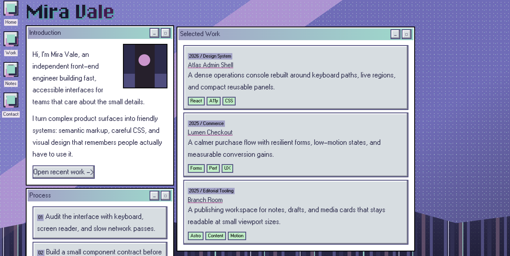
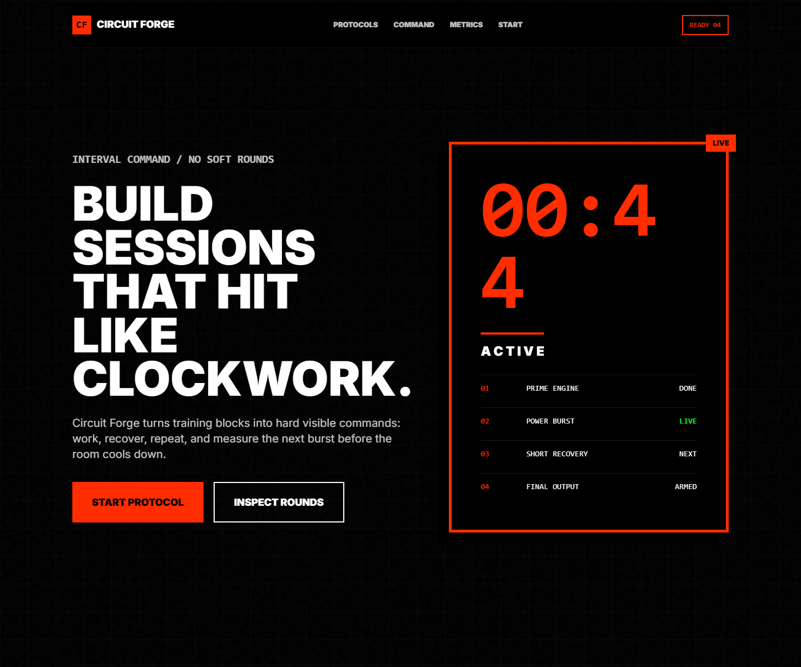

# UIgod

> Turn website design references into reusable style skill packages.

UIgod extracts design tokens (colors, fonts, shapes, spacing, interactions) and inline illustration assets from reference websites, producing standardized child skill packages for future web generation.

## Skill Gallery

| Preview | Reference | Skill | Style |
|---------|-----------|-------|-------|
|  | nicchan.me | [nicchan-pixel-desktop-portfolio](skills/nicchan-pixel-desktop-portfolio/) | Pixel desktop portfolio · lo-fi retro UI · monospace display |
|  | neurohack.blue | [lonely-blue-field-notes](skills/lonely-blue-field-notes/) | Dark editorial journal · serif display · signal accents · warm ink |
|  | namesake.gg | [namesake-soft-civic-guides](skills/namesake-soft-civic-guides/) | Soft civic guides · warm neutral palette · serif headers |
|  | hiitmaster.app | [hiitmaster-brutal-interval-timer](skills/hiitmaster-brutal-interval-timer/) | Brutal interval timer · dark mode · bold numbers · minimal chrome |

## Skill Structure

```
child-skill/
├── DESIGN.md              # Design system — colors/fonts/shapes/components
├── SKILL.md               # Agent instructions — when to use, what to preserve
├── README.md              # Human summary
├── preview.html           # Token specimens — swatches, type, shapes
├── references/
│   ├── source-observations.md        # CSS extraction log
│   ├── source-screenshots-or-notes/  # Reference screenshots
│   └── code-patterns/                # Reusable HTML/CSS snippets
└── examples/
    ├── index.html          # Style transfer verification
    └── preview.png         # Example preview image
```

## How It Works

1. **Fetch & Extract** — Grab ALL CSS files, pick the largest (>10KB). Extract custom properties, fonts, borders, typography. Also extract inline SVG illustrations from HTML.
2. **Resolve & Detect** — Follow `var()` chains to literal values. Detect the active theme.
3. **Generate** — Produce a child skill with DESIGN.md, code patterns, preview, and a transfer example.

## Docs

| Document | Purpose |
|----------|---------|
| [SKILL.md](SKILL.md) | UIgod meta-skill workflow |
| [REFERENCE-ANALYSIS-GUIDE.md](docs/REFERENCE-ANALYSIS-GUIDE.md) | CSS + HTML asset extraction protocol |
| [CHILD-SKILL-SKELETON.md](docs/CHILD-SKILL-SKELETON.md) | Child skill structure standard |
| [QUALITY-CHECKLIST.md](docs/QUALITY-CHECKLIST.md) | Quality gates for child skills |
| [DECISIONS.md](docs/DECISIONS.md) | Product decisions & lessons learned |
