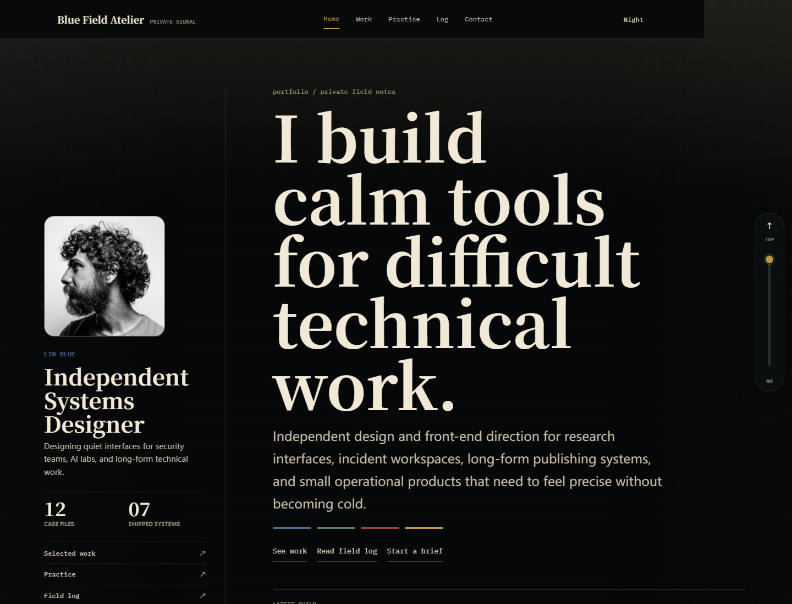
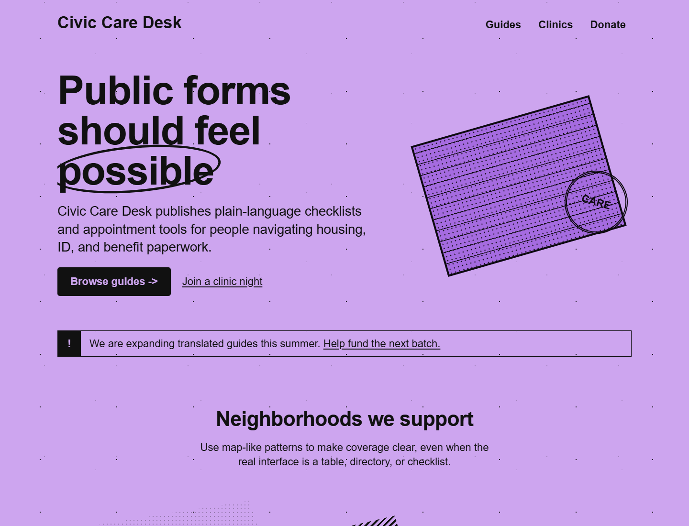

# UIgod

UIgod is a flat skills repository for turning website and UI references into reusable Codex web-design styles.

The layout follows the same broad shape as the Superpowers skills directory: every installable skill lives at `skills/<skill-name>/` and owns its own `SKILL.md`.

## Quick AI Setup

Point your AI client at this repository's `skills/` directory, or copy/link the two coordinator skills into your local skills directory:

```text
skills/uigod/
skills/style-manager/
```

If your client supports a skills path setting, prefer referencing the repository directly so `git pull` updates the whole style library:

```toml
[skills]
paths = ["path/to/UIgod/skills"]
max_depth = 4
```

`uigod` extracts reference evidence, writes `DESIGN.md`, builds preview pages, creates transfer examples, and generates managed style packages.

`style-manager` lists, selects, and applies the managed style packages.

Managed styles live under `skills/style-manager/styles/`. They keep their own nested `SKILL.md`, so agents can still discover and load a specific style when nested skill scanning is enabled, while the manager remains the friendly catalog and default selection layer.

## Usage

UIgod is meant to be used through AI/skill calls, not by asking users to run Python.

### List Styles

Ask:

```text
Use style-manager to list the available styles.
```

Expected behavior: the agent reads the style library and returns style ids with short descriptions.

### Choose A Style

Ask:

```text
Use style-manager to help me choose a style for a dark personal knowledge-base homepage.
```

If the user wants to choose manually, the agent should list the styles and wait.

If there is no conversation step, the agent should use the user's configured preference when present, otherwise the default preference in `skills/style-manager/preferences.example.json`.

### Apply A Style

Ask:

```text
Use the lonely-blue-field-notes style to design a technical writing portfolio.
```

or:

```text
Use style-manager to choose the best bundled style for a landing page about a writing tool, then build the page.
```

Expected behavior: the agent reads the selected style's `SKILL.md` and `DESIGN.md`, then builds fresh content in that style without cloning the original reference site.

### Add A New Reference Style

Ask:

```text
Use uigod to extract the style from https://example.com and add it to the managed style library.
```

Expected behavior: the agent captures evidence, writes a new package under:

```text
skills/style-manager/styles/<new-style-name>/
```

Then it validates the package and updates the style gallery when appropriate.

## Developer Commands

The Python helpers are internal/developer tools. Normal users should call the skills in natural language.

List styles during development:

```bash
python skills/style-manager/tools/list_styles.py
```

Choose non-interactively:

```bash
python skills/style-manager/tools/list_styles.py --choose --prefer "dark editorial technical portfolio"
```

Validate a managed style:

```bash
python skills/uigod/tools/validate_child_skill.py skills/style-manager/styles/<new-style-name>
```

## Skill Gallery

| Preview | Reference | Skill | Style |
|---|---|---|---|
|  | nicchan.me | [nicchan-pixel-desktop-portfolio](skills/style-manager/styles/nicchan-pixel-desktop-portfolio/) | Pixel desktop portfolio, lo-fi retro UI, monospace display |
|  | neurohack.blue | [lonely-blue-field-notes](skills/style-manager/styles/lonely-blue-field-notes/) | Dark editorial journal, serif display, signal accents |
|  | namesake.gg | [namesake-soft-civic-guides](skills/style-manager/styles/namesake-soft-civic-guides/) | Soft civic guide pages, warm neutral palette, serif headers |
|  | hiitmaster.app | [hiitmaster-brutal-interval-timer](skills/style-manager/styles/hiitmaster-brutal-interval-timer/) | Brutal interval timer, dark mode, bold numbers |

## Flat Skill Namespace

```text
skills/
├── uigod/                         # visible meta-skill
└── style-manager/                 # visible style selector
    └── styles/                    # nested managed style library
        ├── hiitmaster-brutal-interval-timer/
        ├── lonely-blue-field-notes/
        ├── namesake-soft-civic-guides/
        └── nicchan-pixel-desktop-portfolio/
```

## Managed Style Contract

Each generated managed style package uses:

```text
skills/style-manager/styles/<style-name>/
├── SKILL.md
├── DESIGN.md
├── preview.html
├── references/
│   ├── source-observations.md
│   └── code-patterns/
└── examples/
    └── index.html
```

`DESIGN.md` is the design brain. `SKILL.md` is the short operational wrapper. `preview.html` is a local token and component specimen. `examples/index.html` proves that the style transfers to fresh content.

## UIgod Package

- [skills/uigod/SKILL.md](skills/uigod/SKILL.md): meta-skill workflow
- [skills/uigod/docs/CONTRACT.md](skills/uigod/docs/CONTRACT.md): generated style skill contract
- [skills/uigod/docs/REFERENCE-ANALYSIS-GUIDE.md](skills/uigod/docs/REFERENCE-ANALYSIS-GUIDE.md): CSS and HTML evidence extraction protocol
- [skills/uigod/tools/extract_style_evidence.py](skills/uigod/tools/extract_style_evidence.py): helper for fetching HTML/CSS evidence
- [skills/uigod/tools/validate_child_skill.py](skills/uigod/tools/validate_child_skill.py): contract validator
- [skills/style-manager/SKILL.md](skills/style-manager/SKILL.md): style listing, selection, and application workflow
- [skills/style-manager/tools/list_styles.py](skills/style-manager/tools/list_styles.py): managed style catalog helper
